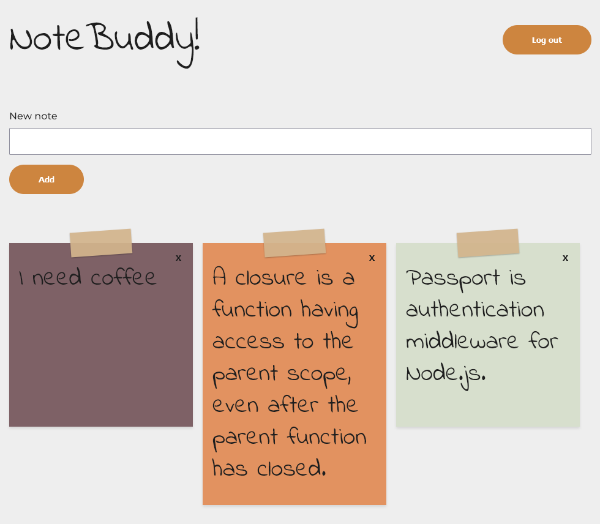

# Notebuddy

## Full stack MVC app with auth for 100Devs Class.

**Link to project:** https://notebuddy.up.railway.app/

  

## How It's Made:

**Tech used:**

A full stack app built with Node, Express, EJS, MongoDB and PassportJS for user authentication.

## Optimizations

Completely rewritten from the example app using ESModules instead of CommonJS to compare how the two different ways of writing Node apps.

## Lessons Learned:

- How to implement Passport's local strategy and implement additional middleware to hide/show a logout button.
- How to use middleware to protect routes and provide better UX - If a user is logged in, any attempts to navigate to the index or auth routes will redirect them back to the notes page.
- How to convert CommonJS to ESModules
- How to set a random color on each note while it was being added without requiring any user input.
- How to deploy an app using Railway
